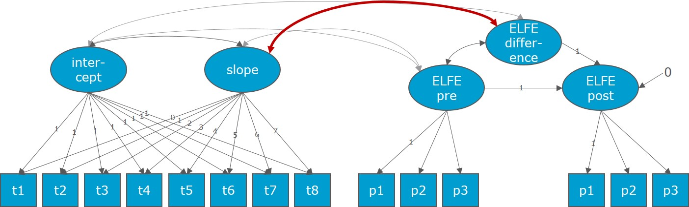

**Post-hoc analysis to better understand the slope validity results on word level as reported in [this notebook](03_main_analysis.html)**.

# Preparations

Conveniently install/load necessary packages.

```{r package management, warning = FALSE, message = FALSE}
ipak <- function(pkg){
  new.pkg <- pkg[!(pkg %in% installed.packages()[, "Package"])]
  if (length(new.pkg)) 
    install.packages(new.pkg, dependencies = TRUE)
  sapply(pkg, require, character.only = TRUE)
}
packages <- c("haven", "chron", "lubridate", "psych", "cNORM", "formattable", "lavaan", "plyr", "naniar", "reshape2", "ggplot2", "dplyr")
ipak(packages)
```

# Read Data

```{r read data, warning = FALSE, message = FALSE}
#read data from SPSS format with haven-package
data = read_sav("Daten/05_Open Science Rohdatensatz_1516_Skalenbildung und Datenbereinigung.sav")
#transform in regular dataframe (read_sav returns a tibble)
data <- as.data.frame(data)
```

# Exclude Infrequent Word Items

```{r exclude infrequent word items, warning = FALSE, message = FALSE}
##EXCLUDE ALL INFREQUENT WORD ITEMS
#2,3,6,9,10,13,16,17,19,20 are item numbers with infrequent words
#$: end of the line, to prevent matching 21,22,...
#ga-variables: shifted one number to the right due to instruction page
data <- data[-c(grep("(t[1-8]_r(2|3|6|9|10|13|16|17|19|20)$)|(t[1-8]_g(2|3|6|9|10|13|16|17|19|20)$)|(t[1-8]_ga(3|4|7|10|11|14|17|18|20|21)$)", colnames(data)))]
#1|4|5|7|8|11|12|14|15|18 are item numbers with frequent words
#make item numbers consecutive: word
names(data)[grep("t[1-8]_r(1|4|5|7|8|11|12|14|15|18)$", colnames(data))] <- paste0("t",rep(1:8,each=10),"_r",rep(1:10,by=8))
names(data)[grep("t[1-8]_g(1|4|5|7|8|11|12|14|15|18)$", colnames(data))] <- paste0("t",rep(1:8,each=10),"_g",rep(1:10,by=8))
names(data)[grep("t[1-8]_ga(2|5|6|8|9|12|13|15|16|19)$", colnames(data))] <- paste0("t",rep(1:8,each=10),"_ga",rep(2:11,by=8))
#make item numbers consecutive: sentence and text
names(data)[grep("t[1-8]_r[2-4][0-9]$", colnames(data))] <- paste0("t",rep(1:8, each=26),"_r",rep(11:36,by=8))
names(data)[grep("t[1-8]_g[2-4][0-9]$", colnames(data))] <- paste0("t",rep(1:8, each=26),"_g",rep(11:36,by=8))
#22 to 49: word and sentence including instruction pages
names(data)[grep("t[1-8]_ga(2[2-9]$|[3-4][0-9]$)", colnames(data))] <- paste0("t",rep(1:8, each=28),"_ga",rep(12:39,by=8))
```

All other processing steps are the same as in the notebook mentioned above until we reach the first change validity model (processing steps not necessary for getting there are omitted here).

# Set Parameters

Define some parameters that are needed for data processing, such as how many items does a quop test consist of.
Here, all infrequent word items are deleted before proceeding with the analyses.

```{r parameters, warning = FALSE, message = FALSE}
#parameters for preprocessing
n_items <- 36
grade_check <- 2
age_check_lb <- 6
age_check_ub <- 12
time_pts <- c(1:8)

#word, sentence and text scale
scales <- c("w", "s", "t")
#quop items
items <- list(1:10, 11:23, 24:36)
#quop items separated into the three scales like this (r and g-variables)
items_start <- c(1, 11, 24)
items_end <- c(10, 23, 36)
#quop pages (1 item per page with instruction pages in between) separated into three scales like this (excluding instruction pages); ga variables
pages_start = c(2, 13, 27)
pages_end = c(11, 25, 39)
#amount of items per scale
n_items_scale <- c(10, 13, 13)

#measures: accuracy and cisrt
msrs <- c("rcp","cisrt")
```

# Preprocess Quop Data

The quop data is preprocessed according to quop norm formation.

Eventually, we compute a reading efficiency measure called **CISRT** specifying the time that is left for solving an item in percent (if the item is sovled incorrectly, the cisrt is 0). How much time there is for solving an item is set via empirically calculated quntile-based cutoffs. 

##4.1 Data Exclusion on subject level

Exclusion criteria are coded in a new variable specifying eg subjects being outside of age borders.

The single steps are:

1. Compute exclusion variable to document data selection

```{r exclusion variable, warning = FALSE, message = FALSE}
data$exclusion <- 0
```

2. Code sujects who changed school or class during the school year or are mistankely listed here although being in the wrong grade or an international/test school.

```{r code school change, warning = FALSE, message = FALSE}
# Exclude data from students who changed class or school during the school year
data$exclusion[data$change>0] <- 1
# exclude testing data
data$exclusion[data$state=="Testschulen"]<-2
# exclude international schools
data$exclusion[data$state=="International"]<-3
# exclude data from other than second grade
data$exclusion[data$grade!=grade_check]<-4
```

3. Prepare time variables (age and testing points)

```{r prepare time variables, warning = FALSE, message = FALSE}
#Make sure birth dates are in character format, then transform into dates saved in new variable
data$s_birth <- as.character(data$s_birth)
data$s_birth_date <- as.Date(data$s_birth, format = "%Y-%m-%d")

#Split testing date variables into date and time variables

#Get testing dates for each timepoint (t1 - t8)
for(i in time_pts){
  #read from spss format, the dates are already represented as dates and not as strings, but to be able to
  #use the string-split logic further down, we make them to strings
  eval(parse(text=paste0("data$t",i,"_date <- as.character(data$t",i,"_date)")))
  eval(parse(text=paste0("data$t",i,"_date_v <- as.Date(sapply(data$t",i,"_date,function(x)unlist(strsplit(x,\" \"
  ))[1]),format = \"%Y-%m-%d\")")))
}

#Get testing time for each time point
for(i in time_pts){
  eval(parse(text=paste0("data$t",i,"_time <- sapply(sapply(data$t",i,"_date,function(x)ifelse(is.na(x),NA,unlist
                         (strsplit(x,\" \"))[2])),function(x)ifelse(is.na(x),NA,ifelse(nchar(x)==8,chron(times=x
                         ,format = \"h:m:s\"),chron(times=paste0(x,\":00\"),format = \"h:m:s\"))))")))
}
```

4. Code subject age

```{r code subject age, warning = FALSE, message = FALSE}
#calculate age at first timepoint of testing
data$s_age <- time_length(interval(data$s_birth_date,data$t1_date_v),"years")
#exclude data when younger than 6
data$exclusion[data$s_age<age_check_lb] <- 5
#exclude data when older than 12
data$exclusion[data$s_age>age_check_ub] <- 6
```

5. Code subjects having missed all tests

```{r subjects missing all tests, warning = FALSE, message = FALSE}
#exclude if all test items are missing
data$exclusion[apply(data[,paste0("t",rep(1:8,each=n_items),"_r",1:n_items)],1,function(x)all(is.na(x)))] <- 7
```

6. Identify duplicate cases

```{r duplicate cases, warning = FALSE, message = FALSE}
#identify duplicate cases
dup_cases <- aggregate(year~code,data,length)
#which cases were duplicates?
dup_students <- dup_cases$code[dup_cases$year>1]
#exclude duplicate cases
data$exclusion[data$code%in%dup_students] <- 8
```

8. Apply exclusion criteria
    + School/class changing subjects are kept

```{r apply exclusion, warning = FALSE, message = FALSE}
### take the data that can be used
quop_use <- data[data$exclusion<2,]
```

## Data Exclusion on Testing Point Level

Single tests are coded as NA when they were completed outside normal school hours (07:45:00 to 13:30:00).

```{r testing time, warning = FALSE, message = FALSE}
for(i in time_pts){
  eval(parse(text=paste0("tm_t",i," <- !is.na(quop_use$t",i,"_time)&(quop_use$t",i,"_time<chron(times=\"07:45:00\",format=\"h:m:s\")|quop_use$t",i,"_time>chron(times=\"13:30:00\",format=\"h:m:s\"))")))
  eval(parse(text=paste0("quop_use[tm_t",i,",grep(\"^t",i,"\",names(quop_use),val=T)]<-NA")))
}
```

## Make Sure Relevant Variables are Numeric

Recode all relevant variables into numeric ones.

```{r recode numeric, warning = FALSE, message = FALSE}
num_vars<-grep("\\_r[[:digit:]]|\\_g[[:digit:]]|\\_ga[[:digit:]]",names(quop_use),val=T)
for(i in num_vars){
  eval(parse(text=paste0("quop_use$",i,"<- as.numeric(quop_use$",i,")")))
}
```

# Cutoffs for Solving Time

## Prepare Cutoff-Variables

For each item in a quop test the following variables are logged:

* r-variables:response accuracy: 1 if item was solved correctly, 0 if item was solved inocorrectly (t1_r2 for first test, second item)

* g-variables: response latency to an item in ms (t1_g2 for first test, second item)

* ga-variables: response latency for a completing a full page in the webbrowser (t1_ga2 for first test, second page)
    + In the second grade, each item is presented on an own page, so the information inside g- and ga-variables is the same (except that the indices are not due to instruction pages in between the items)
    
Cutoff calculation:

1. Copy g-variables into new ones called gqc to preserve the original values
2. Where there are negative values (logging problems) in the gqc-variables (so g- so item-latencies), use the corresponding ga-variable (so page-latency) instead
3. Code all cases still holding negative values NA

```{r prepare cutoff-variables, warning = FALSE, message = FALSE}
#copy g-variables over to new gqc-variables to be used for calculating quantile-based cutoffs
for(i in time_pts){
  for(j in 1:n_items){
    eval(parse(text=paste0("quop_use$t",i,"_gqc",j,"<- quop_use$t",i,"_g",j)))
  }
}

#where there are negative times recorded in the gqc-variables, use the corresponding ga-variable value instead
#(hoping it is not negatuve) (!: ga also contains instruction pages)
#first and last item (one per page) between the instruction pages
for(i in time_pts){
  for(j in 1:length(pages_start)){
    for(k in pages_start[j]:pages_end[j]){
      eval(parse(text=paste0("quop_use$t",i,"_gqc",k-j,"<- ifelse(quop_use$t",i,"_gqc",k-j,"<=0,quop_use$t",i,"_ga",k,", quop_use$t",i,"_gqc",k-j,")")))
    }
  }
}

#now set all cases that still have negative values to NA
for(i in time_pts){
  #8 instruction pages
  for(j in 1:(n_items)){
    eval(parse(text=paste0("quop_use$t",i,"_gqc",j,"<- ifelse(quop_use$t",i,"_gqc",j,"<=0,NA,quop_use$t",i,"_gqc",j,")")))
  }
}
```

## Calculate Cutoffs

The 5%- and 95%-latency-quantiles (averaged over all items per scale) are used to determine lower and upper bounds for response time.

```{r calcualte cutoffs, warning = FALSE, message = FALSE}
#word
#average .05 quantile over all items
w_lb <- mean(apply(quop_use[,paste0("t",rep(time_pts,each=n_items_scale[1]),"_gqc",items_start[1]:items_end[1])],2,quantile,na.rm=T,p=.05))
#average .95 quantile over all items
w_ub <- mean(apply(quop_use[,paste0("t",rep(time_pts,each=n_items_scale[1]),"_gqc",items_start[1]:items_end[1])],2,quantile,na.rm=T,p=.95))

#sentence
#average .05 quantile over all items
s_lb <- mean(apply(quop_use[,paste0("t",rep(time_pts,each=n_items_scale[2]),"_gqc",items_start[2]:items_end[2])],2,quantile,na.rm=T,p=.05))
#average .95 quantile over all items
s_ub <- mean(apply(quop_use[,paste0("t",rep(time_pts,each=n_items_scale[2]),"_gqc",items_start[2]:items_end[2])],2,quantile,na.rm=T,p=.95))

#text
#average .05 quantile over all items
t_lb <- mean(apply(quop_use[,paste0("t",rep(time_pts,each=n_items_scale[3]),"_gqc",items_start[3]:items_end[3])],2,quantile,na.rm=T,p=.05))
#average .95 quantile over all items
t_ub <- mean(apply(quop_use[,paste0("t",rep(time_pts,each=n_items_scale[3]),"_gqc",items_start[3]:items_end[3])],2,quantile,na.rm=T,p=.95))
```

Permitted response times (s) are:

* Word scale: `r round(w_lb/1000,2)` - `r round(w_ub/1000,2)` 

* Sentence scale: `r round(s_lb/1000,2)` - `r round(s_ub/1000,2)` 

* Text scale: `r round(t_lb/1000,2)` - `r round(t_ub/1000,2)` 


## Apply Cutoffs

Create corrected latency variables (coded as NA outside of the cutoff range) and code accuracy variables as NA when latency was outside of the curoff range.

```{r apply cutoffs, warning = FALSE, message = FALSE}
#create corrected g variables (coded as NA outside the range)
for(i in time_pts){
  for(j in 1:length(scales)){
    for(k in items_start[j]:items_end[j]){
      eval(parse(text=paste0("quop_use$t",i,"_gc",k,"<- ifelse(quop_use$t",i,"_gqc",k,"<",scales[j],"_lb|quop_use$t",i,"_gqc",k,">",scales[j],"_ub,NA,quop_use$t",i,"_gqc",k,")")))
    }
  }
}

#create corrected r variables (coded as NA when corrected response time is NA)
for(i in time_pts){
  for(j in 1:n_items){
    eval(parse(text=paste0("quop_use$t",i,"_rc",j,"<- ifelse(is.na(quop_use$t",i,"_gc",j,"),NA,quop_use$t",i,"_r",j,")")))
  }
}
```

# Efficiency Measure CISRT

**CISRT** = Correct Item Summed Residual Time refering to the time left for solving an item in percent(0 if the item is answered incorrectly).

Calculation formula: 

$\mathbf{CISRT} = correct * (1 - \frac{latency-bound_{lower}}{bound_{upper}-bound_{lower}}) * 100)$ 

with correct either resolving to 0 or 1.

```{r calculate cisrt, warning = FALSE, message = FALSE}
#calculate correct item summed residual time (cisrt)
for(i in time_pts){
  for(j in 1:length(scales)){
    for(k in items_start[j]:items_end[j]){
      eval(parse(text=paste0("quop_use$t",i,"_cisrt",k,"<- quop_use$t",i,"_rc",k,"*(1-((quop_use$t",i,"_gc",k,"-",scales[j],"_lb)/(",scales[j],"_ub-",scales[j],"_lb)))*100")))
    }
  }
}
```

# Overall Scores

Now that we have an efficiency measure per item, we can create overall scores per scale.

First, create an accuracy variable not holding 1s and 0s but 100s and 0s in order to stay with the percent scale when calculating overall scores.

Next, calculate average accuracy (amount of correctly solved items) and effiency (CISRT) for each subject for each testing point for each scale with item-median imputation in case of missings. 

```{r overall scores, warning = FALSE, message = FALSE}
#rc-variables times 100 as we use averages in the Scoring-procedure and want to finally have percent
for(i in time_pts){
  for(j in 1:n_items){
    eval(parse(text=paste0("quop_use$t",i,"_rcp",j,"<-quop_use$t",i,"_rc",j,"*100")))
  }
}

#Merging into quop_use
for(g in 1:length(scales)){
  
  for(h in 1:length(msrs)){
    
    ### create data frames holding only set items
    for(i in time_pts){
      eval(parse(text=paste0(scales[g],"_",msrs[h],"_t",i," <- quop_use[,\"code\"]")))
      eval(parse(text=paste0(scales[g],"_",msrs[h],"_t",i," <- as.data.frame(",scales[g],"_",msrs[h],"_t",i,")")))
      eval(parse(text=paste0("names(",scales[g],"_",msrs[h],"_t",i,")[1] <- \"code\"")))
      for(j in items[[g]]){
        ### only items from current scale
        eval(parse(text=paste0(scales[g],"_",msrs[h],"_t",i,"$t",i,"_",msrs[h],j," <- quop_use[,\"t",i,"_",msrs[h],j,"\"]")))
      }
    }
    
    for(i in time_pts){
      ### exclude rows with only missings
      eval(parse(text=paste0(scales[g],"_",msrs[h],"_t",i," <- ",scales[g],"_",msrs[h],"_t",i,"[apply(",scales[g],"_",msrs[h],"_t",i,"[,-1],1,function(x)!all(is.na(x))),]")))
      
      ### average sum score with item-median imputation in case of missings
      eval(parse(text=paste0(scales[g],"_",msrs[h],"_t",i,"$raw <- scoreItems(rep(",1,",",length(items[[g]]),"),",scales[g],"_",msrs[h],"_t",i,"[,-1],totals=F)$scores")))
      
      ### merge score with quop_use dataframe
      eval(parse(text=paste0("names(",scales[g],"_",msrs[h],"_t",i,")[length(",scales[g],"_",msrs[h],"_t",i,")] <- \"",scales[g],"_",msrs[h],"_t",i,"\"")))
      eval(parse(text=paste0("quop_use <- merge(quop_use, ",scales[g],"_",msrs[h],"_t",i,"[c(\"code\",\"",scales[g],"_",msrs[h],"_t",i,"\")], by=\"code\", all=T)")))
      #eval(parse(text=paste0("quop_use$",scales[g],"_",msrs[h],"_t",i," <- ",scales[g],"_",msrs[h],"_t",i,"$raw")))
    }
  }
}
```


# Extract Standardized Test Scores and Teacher Judgments

This only includes the subsample having completed the standardized tests and being judged by their teachers.
We extract this data and merge it with the quop test data from this subsample.
For the CFT (Intelligence), total scores are only present for 147 subjects. That's because if there is a certain critical difference between parts 1 and 2 (T-value of 7 and more), the total score mustn't be calculated (according to the manual). Part 1 covers things like perception speed, part 2 more like basic intellectual skills. We are just going to use part 2 here.

```{r extract subsample, warning = FALSE, message = FALSE}
elfe <- data.frame(quop_use$code, quop_use$class, quop_use$school, quop_use$state, quop_use$s_age, quop_use$s_sex, quop_use$wort_rw, quop_use$wort_pr, quop_use$satz_rw, quop_use$satz_pr, quop_use$text_rw, quop_use$text_pr, quop_use$wort_rw_2, quop_use$wort_pr_2, quop_use$satz_rw_2, quop_use$satz_pr_2, quop_use$text_rw_2, quop_use$text_pr_2, quop_use$demat_rw, quop_use$demat_pr, quop_use$cftTeil2, quop_use$In_wort, quop_use$In_satz, quop_use$In_text, quop_use$Di_wort, quop_use$Di_satz, quop_use$Di_text)
names(elfe) <- c("code", "class", "school", "state", "s_age", "s_sex", "w_rw_pre", "w_pr_pre", "s_rw_pre", "s_pr_pre", "t_rw_pre", "t_pr_pre", "w_rw_post", "w_pr_post", "s_rw_post", "s_pr_post", "t_rw_post", "t_pr_post", "demat_rw", "demat_pr", "cft", "tr_in_w", "tr_in_s", "tr_in_t", "tr_di_w", "tr_di_s", "tr_di_t")

#delete all cases that only have NAs (quop-users that didn't take the paper-pencil elfe tests)
elfe <- elfe[apply(elfe[,-c(1:6)],1,function(x)!all(is.na(x))),]

elfe_quop <- merge(quop_use[c("code","class","school","state","s_age","s_sex",colnames(quop_use)[grep("(^w_|^s_|^t_)(rcp|cisrt)", colnames(quop_use))])], elfe, by=c("code","class","school","state","s_age","s_sex"))
```


# Validity of Change Measurement - Renalayze with Frequent Words Only

Indicator: Correlation of the slope of a linear latent growth model estimated over all quop scores (testing points 1 to 8) with the latent difference between elfe pre and post scores of a Latent Change Model. Word level only, only including quop scores based on frequent words.



First, we build 3 elfe parcels per scale according to the quop parcels.

```{r elfe parcels, warning = FALSE, message = FALSE}
elfe_parcels <- quop_use[,c("code","class")]
tests <- c("", "_2")
scales <- c("Wort", "Satz", "Text")
new_scales <- c("w", "s", "t")
items_start <- c(1, 1, 1)
items_end <- c(75, 36, 26)
#For each scale, for each testing point

#WITHOUT SCALE()
for(h in 1:length(scales)){
  
  for(i in tests){
    #first parcel
    eval(parse(text=paste0("elfe_parcels$",new_scales[h],"_elfe",which(tests==i),"_parcel1 <- ifelse(
                           apply(quop_use[,paste0(\"",scales[h],"Korrekt\",seq(",items_start[h],",",items_end[h],"),i)],1,function(x){all(is.na(x))}),
                           NA,
                           rowSums(quop_use[,paste0(\"",scales[h],"Korrekt\",seq(",items_start[h],",",items_end[h],",by=3),i)],na.rm=T))")))
    #second parcel
    eval(parse(text=paste0("elfe_parcels$",new_scales[h],"_elfe",which(tests==i),"_parcel2 <- ifelse(
                           apply(quop_use[,paste0(\"",scales[h],"Korrekt\",seq(",items_start[h],",",items_end[h],"),i)],1,function(x){all(is.na(x))}),
                           NA,
                           rowSums(quop_use[,paste0(\"",scales[h],"Korrekt\",seq(",items_start[h]+1,",",items_end[h],",by=3),i)],na.rm=T))")))
    #third parcel
    eval(parse(text=paste0("elfe_parcels$",new_scales[h],"_elfe",which(tests==i),"_parcel3 <- ifelse(
                           apply(quop_use[,paste0(\"",scales[h],"Korrekt\",seq(",items_start[h],",",items_end[h],"),i)],1,function(x){all(is.na(x))}),
                           NA,
                           rowSums(quop_use[,paste0(\"",scales[h],"Korrekt\",seq(",items_start[h]+2,",",items_end[h],",by=3),i)],na.rm=T))")))
  }
}

#Make NaNs to NA (Where are they coming from???)
#is.nan() behaves differently than is.na() for dataframes but for a matrix, it works just like is.na() does for dataframes
elfe_parcels[is.nan(as.matrix(elfe_parcels))] <- NA

#Get rid of all sujects who only took part in quop but not in elfe
elfe_parcels <- elfe_parcels[apply(elfe_parcels[,-c(1:2)],1,function(x)!all(is.na(x))),]
```

Then, merge the elfe parcels into the dataframe holding the quop scores, quop parcels, standardized test scores and teacher jdugments.

```{r merge elfe parcels, warning = FALSE, message = FALSE}
elfe_quop <- merge(elfe_quop, elfe_parcels, by=c("code","class"))
```

Extract datasets for each scale and rename the columns to be a bit more handy. (Also, only keep cases for which both ELFE tests (pre and post) have been completed.

```{r dataset per scale change, warning = FALSE, message = FALSE}
##Extract
#word
ch_val_wort <- elfe_quop[c("code","class", colnames(elfe_quop)[grep("(^w_)cisrt", colnames(elfe_quop))], colnames(elfe_quop)[grep("(^w_)(t1|t8)_parcel", colnames(elfe_quop))], colnames(elfe_quop)[grep("(^w_)elfe", colnames(elfe_quop))])]

##Rename
#Word
names(ch_val_wort) <- c("code", "class", paste0("q",seq(1,8)), paste0("e",rep(1:2,each=3),"_p",rep(1:3,times=2)))

##Only keep cases where both elfe tests have been completed (if one test has not been completed, there are 3 parcels (== 1 test) missing)
#Word
ch_val_wort <- ch_val_wort[apply(ch_val_wort[,c(colnames(ch_val_wort)[grep("e[1-2]", colnames(ch_val_wort))])], 1, function(x)sum(is.na(x))<3),]
```

Implement Change Validity Model: We ware interested in the correlation of the the latent slope estimated over all quop scores (testing points 1 to 8) and the latent difference between elfe pre and post scores. (Information about Latent Growth Model in [lavaan](https://lavaan.ugent.be/tutorial/growth.html).)

```{r change validity model, warning = FALSE, message = FALSE}
ch_val_model_1 <- '
                ##LATENT CHANGE MODEL: ELFE
                #LV for elfe pre and post
                #Same loadings for 2nd/3rd parcel between time points
                #Loadings for the 1st parcel per time point are restricted to 1 by default for
                #model identification
                ELFE_pre =~ e1_p1 + a*e1_p2 + b*e1_p3
                ELFE_post =~ e2_p1 + a*e2_p2 + b*e2_p3

                #We need to introduce the LV of the difference which is not measured by an 
                #indicator. So define it by make any indicator load on it with 0
                D_ELFE =~ 0*e1_p1
      
                #Perfect regression: LV ELFE_post is made up of the sum of ELFE_pre and 
                #the difference, with no error
                ELFE_post ~ 1*ELFE_pre + 1*D_ELFE
                ELFE_post ~~ 0*ELFE_post
      
                #allow indicator-specific covariances between the same parcel over measurements
                #(errors covary)
                e1_p1 ~~ e2_p1
                e1_p2 ~~ e2_p2
                e1_p3 ~~ e2_p3

                #mean structure
                e1_p1 ~ 0*1
                e2_p1 ~ 0*1
                e1_p2 ~ 0*1
                e2_p2 ~ 0*1
                e1_p3 ~ 0*1
                e2_p3 ~ 0*1
                D_ELFE ~ NA*1
                ELFE_pre ~ NA*1
        
      
                ##LATENT GROWTH MODEL: QUOP
                #LV intercept on which all indicators loadings are 1
                intercept =~ 1*q1 + 1*q2 + 1*q3 + 1*q4
                           + 1*q5 + 1*q6 + 1*q7 + 1*q8

                #LV slope with linearly increasing loadings
                      slope =~ 0*q1 + 1*q2 + 2*q3 + 3*q4
                             + 4*q5 + 5*q6 + 6*q7 + 7*q8

                #mean structure
                q1 ~ 0*1
                q2 ~ 0*1
                q3 ~ 0*1
                q4 ~ 0*1
                q5 ~ 0*1
                q6 ~ 0*1
                q7 ~ 0*1
                q8 ~ 0*1
                slope ~ NA*1
                intercept ~ NA*1
      
                #the parameter we are ultimately interested into
                D_ELFE ~~ slope
                '
```

Functions to conveniently extract fit measures and parameter estimates from the fitted models.

```{r convenience functions to extract results, warning = FALSE, message = FALSE}
#fit measures
fit_msrs <- function(fit){
  res <- as.data.frame(t(round(fitMeasures(fit)[c("rmsea", "srmr","cfi", "tli")],3)))
  names(res) <- toupper(names(res))
  return(res)
}

#parameter estimates
extract_res <- function(fit, lhs="slope", op="~1", rhs=""){
  #standardizedsolution() to conveniently access standardized parameter estimates and corresponding SEs 
  st_sol <- standardizedsolution(fit)
  est <- round(st_sol$est.std[st_sol$lhs==lhs & st_sol$op==op & st_sol$rhs==rhs],2)
  se <- round(st_sol$se[st_sol$lhs==lhs & st_sol$op==op & st_sol$rhs==rhs],2)
  p <- round(st_sol$pvalue[st_sol$lhs==lhs & st_sol$op==op & st_sol$rhs==rhs],4)
  res <- c(est,se,p)
  names(res) <- c("Estimate","SE","P-value")
  return(res)
}
```

Estimate Model for the word scale based on frequent words only.

**Word**

```{r estimate word model change, warning = FALSE, message = FALSE}
ch_val_wort.fit <- cfa(ch_val_model_1, data=ch_val_wort, estimator="mlr", missing="fiml", cluster="class")
#fit measures
fit_msrs_w <- fit_msrs(ch_val_wort.fit)
(fit_msrs_w_f <- formattable(fit_msrs_w))
#parameter estimates
lhs <- c("slope","D_ELFE","D_ELFE")
op <- c("~1", "~1", "~~")
rhs <- c("", "", "slope")
estimates_w <- data.frame(t(mapply(function(lhs,op,rhs){extract_res(ch_val_wort.fit, lhs,op,rhs)}, lhs, op, rhs)))
row.names(estimates_w) <- paste0(lhs,op,rhs)
(estimates_w_f <- formattable(estimates_w))
#summary(ch_val_word.fit, std=T, fit.measures=T)
```